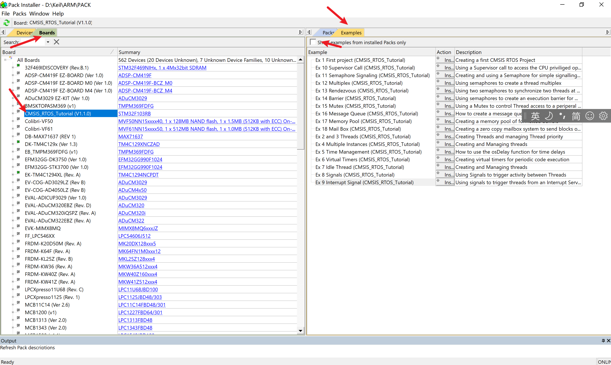
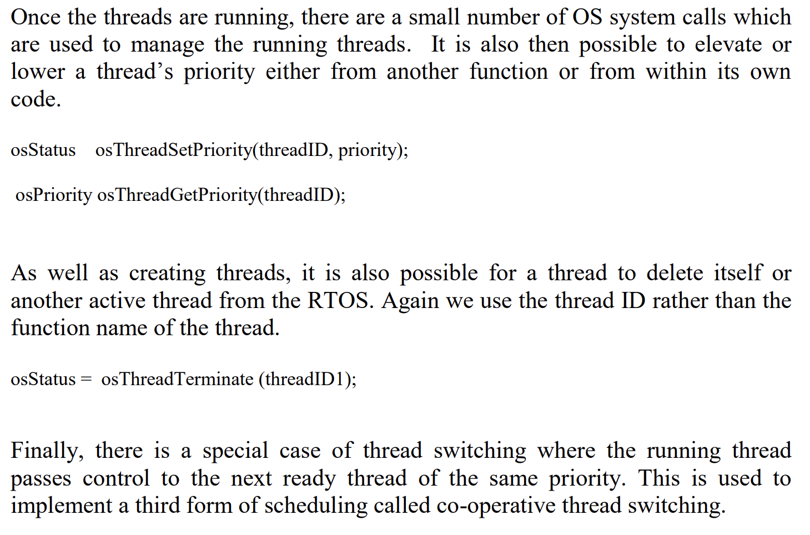
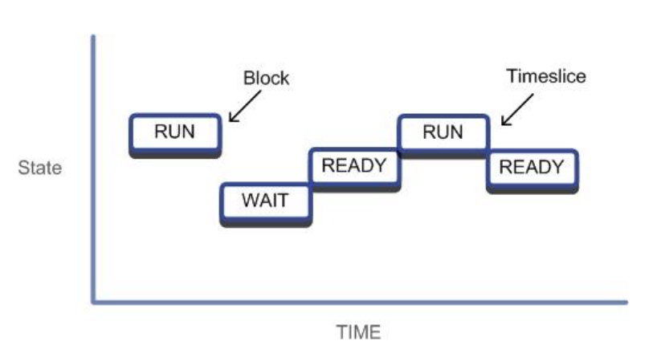
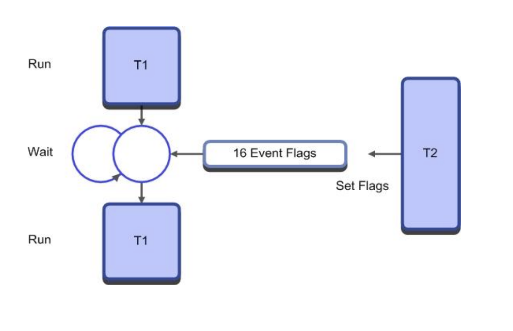
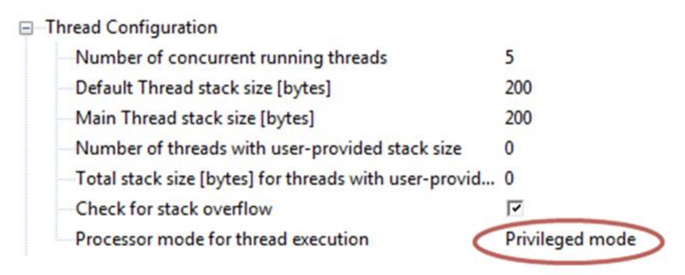
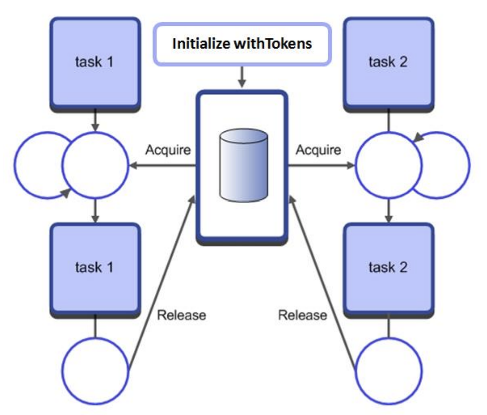
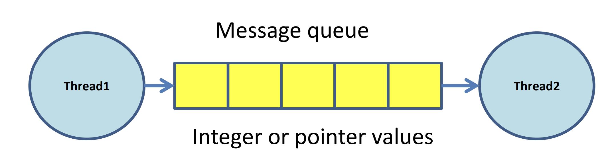
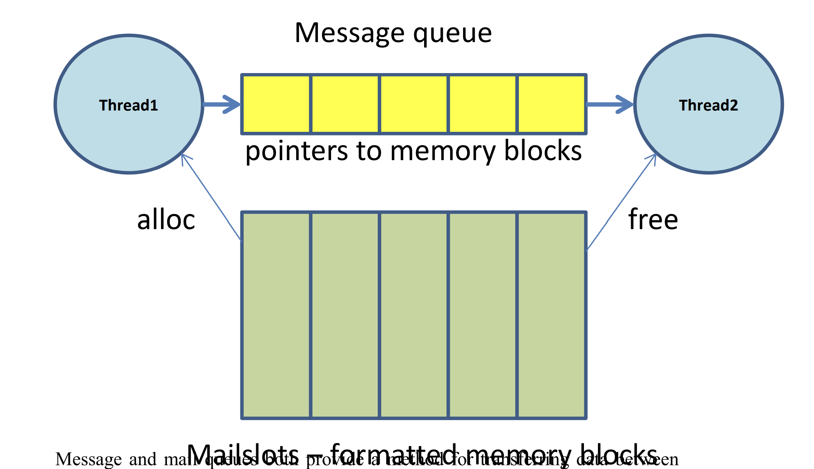
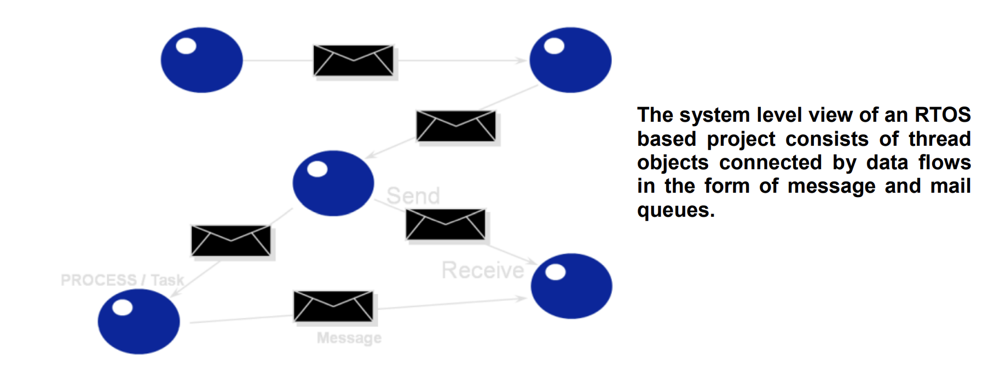

# RTX手册阅读笔记

阅读RTX手册，记录其中一些函数用法，简介，包括OsDelay,Virtual_Timer,os_idle_demon,Signals,Semaphore,Mutex,Message_queue,Mail_queue


# 一、创建进程函数

>   1.   main_id = os ThreadGetId();获取当前运行的进程
>
>   2.   os_Terminate(main_id)结束当前运行的进程

1.   osThreadId thread1_id;	//thread handle

2.   void thread1 (void const *argument); //function prototype for thread1

3.   osThreadDef(thread1,osPriorityNormal,==1==,==0==);//function prototype for thread1

     1.   osThreadDef(thread1, osPriorityNormal, 1, 0); //assign default stack size to this thread 

     2.   osThreadDef(thread2, osPriorityNormal, 1, 1024); //assign 1KB of stack to this thread

          可以配置stack也就是堆的大小，默认是0，配置了之后是1024

4.   thread1_id = osThreadCreate(osThread(thread1), NULL);

     1.   uint32_t startupParameter = 0x23;//可以在NULL里面输入参数
     2.   thread1_id = osThreadCreate(osThread(thread1), startupParameter);

5.   看RTX提供的例程

     1.   点击

     2.   按图示箭头选择

     3.   示例代码

          ```c
          osThreadId main_ID,led_ID1,led_ID2; 
          
          osThreadDef(led_thread2, osPriorityNormal, 1, 0); 
          
          osThreadDef(led_thread1, osPriorityNormal, 1, 0);
          
          osThreadId main_ID,led_ID1,led_ID2; 
          
          osThreadDef(led_thread2, osPriorityNormal, 1, 0); 
          osThreadDef(led_thread1, osPriorityNormal, 1, 0);
          
          void led_thread2 (void const *argument) {
           for (;;) {
           LED_On(1); 
           delay(500);
           LED_Off(1);
           delay(500);
          }}
          ```

# 二、管理优先级

## 1.优先级划分

1.   osPriorityIdle 

2.   osPriorityLow 

3.   osPriorityBelowNormal 

4.   osPriorityNormal 

5.   osPriorityAboveNormal 

6.   osPriorityHigh 

7.   osPriorityRealTime 

8.   osPriorityError

     >   优先级依次提高

## 2.获取优先级

1.   osStatus osThreadSetPriority(threadID, priority);//切换进程优先级
2.   osPriority osThreadGetPriority(threadID);//
3.   osStatus = osThreadTerminate (threadID1);//删除进程

>   没太看明白上面的2。



# 三、延时函数

## 1.osDelay

```
void osDelay (uint32_t millisec )
```

进程进入等待模式


## 2.Waiting for an Event

```
osStatus osWait (uint32_t millisec )
```

将进程切换到等待事件的模式，等信号，消息，邮件事件调用，后面时间的填写是假如没有事件到来，那就继续运行

这是只有RTX版本1才有的等待事件

## 虚拟定时器（Virtual Timers）

使用虚拟定时器结构体创建定时器

```
osTimerDef(timer0,led_function);
```

>   创建了一个timer0的定时器，以及在定时器之后会调用的函数led_function

```
osTimerId timer0_handle = osTimerCreate (timer(timer0), osTimerPeriodic, (void *)0);
```

>   1.   timer0需要被创建为一个进程
>   2.   第二个参数osTimerPeriodic意为周期性定时器，也可以选择单词定时器osTimerOnce只运行一次
>   3.   最后一个参数定时器结束后输入到调用函数的参数

```
osTimerStart ( timer0_handle,0x100);
```

>   启动定时器可以在任意一个进程启动，启动定时器，结束后将参数传递到函数入口

Tips:osDelay提供相对延时时间，相对delay开始的时间，Virtual Timer提供绝对时间，这个时间是绝对的。

## Sub millisecond delays延时的另一种实现方式

 获取两次系统节拍SysTick，比较两个系统节拍的次数是否在延时时间次数内，在则循环。

```c
int32_t tick,delayPeriod;
tick = osKernelSysTick(); // get start value of the Kernel system tick
delayPeriod = osKernelTickMicroSec(100));
do { // Delay for 100 microseconds
    } while ((osKernelSysTick() - tick) < delayPeriod); 
```

# 四、空闲进程

```
void os_idle_demon (void) 
{
for (;;) {
/* HERE: include here optional user code to be executed when no thread runs. */
 }
} /* end of os_idle_demon */
```

>   在没有进程运行时进入空闲进程，进入空闲进程之后是什么模式取决于MCU的电源管理模式。
>
>   CPU会停止运行，当有SysTick中断或者调度器调度时才会恢复过来，不然系统就进入睡眠模式

# 五、进程之间的交互Inter-Thread Communication

>   进程之间的交流使用signals, semaphores, mutexes, mailboxes and message  queues
>
>   第一节的关键是并发性
>
>   这一节的关键是同步

## 1.Signals

>   RTX每一个进程最多支持16个signal flags，这些signal flags存储在进程的控制区thread control block
>
>   另一个进程的signal flag或者group of signal flags 没有被设置的时候，这个进程停止



```
osEvent osSignalWait ( int32_t signals,uint32_t millisec);
```

>   当T1进程等待时间过长时，使用函数使得T1进程能够运行
>
>   当signals设置为0时，任意一个信号都可以使进程恢复
>
>   第二个参数可以填osWaitForever一直等待


```
int32_t osSignalSet ( osThreadId thread_id, int32_t signals);
int32_t osSignalClear ( osThreadId thread_id, int32_t signals);
```

>   任意一个进程可以设置或者清除一个信号给另一个进程

示例：

```
void led_Thread2 (void const *argument) {
 for (;;) { 
LED_On(2);
osSignalSet (T_led_ID1,0x01);
osDelay(500);
LED_Off(2);
osSignalSet (T_led_ID1,0x01);
osDelay(500);}}

void led_Thread1 (void const *argument) {
for (;;) {
osSignalWait (0x01,osWaitForever);
LED_On(1); 
osSignalWait (0x01,osWaitForever);
LED_Off(1);
}}
```

>   这两个进程就好像同步进行一样，一起开一起关

### 1.1RTOS对中断的处理 RTOS Interrupt Handling

>   在RTOS中中断会打断SysTick，产生延时,这会造成RTOS内核混乱，为了避免这种混乱，最好使用进程的形式处理外部中断，并且把这个进程优先级提到最高

示例：

```
void Thread3 (void)
{
while(1)
{
osSignalWait ( isrSignal,waitForever); // Wait for the ISR to trigger an event
….. // Handle the interrupt
} // Loop round and go back sleep
}

void IRQ_Handler (void)
{
osSignalSet (tsk3,isrSignal); // Signal Thread 3 with an event
}
```


示例9	EX9

```
osThreadDef(adc_Thread, osPriorityAboveNormal, 1, 0);
int main (void) {
LED_Init ();
init_ADC ();
T_led_ID1 = osThreadCreate(osThread(led_Thread1), NULL);
T_led_ID2 = osThreadCreate(osThread(led_Thread2), NULL);
T_adc_ID = osThreadCreate(osThread(adc_Thread), NULL);

led_Thread2
{
	osDeelay(500);
	ADC1->CR2	|=	(1UL << 22);
	LED_Off(2);
}
adc_Thread()
{
	osSignalWait	(0x01,osWaitForever);
	GPIO->ODR = ADC1->DR;
}
ADC1_2_Handler()
{
	osSognalSet(T_adc_ID,0x01);
}
```

>   需要在特权模式下运行，因为在非特权模式下不可以访问中断



>   为了解决非特权模式下中断问题，配置用户SVC模式

## 2.Semaphores

>   Semaphores运用在多个线程中，一个Semaphores就是包含了很多个token的容器
>
>   当一个进程运行时，Semaphores会减少一个token,当没有token时，另一个进程运行到Semaphores时会进入等待状态
>
>   进程在运行时也可以产生一个token到Semaphores中。



>   为了解决进程呼叫过程中也就是使用signal进行进程间交流时产生的次序混乱，程序难以读懂的情况，引入Semaphore对进程进行管理，使得进程之间影响减小。

运用：

```
osSemaphoreId sem1;
osSemaphoreDef(sem1);

sem1 = osSemaphoreCreate(osSemaphore(sem1), SIX_TOKENS);//创建6个tokens

osStatus osSemaphoreWait(osSemaphoreId semaphore_id, uint32_t millisec);//等待semaphore
osStatus osSemaphoreRelease(osSemaphoreId semaphore_id);//释放semaphore
```

示例11

```c
//创建sem1
osSemaphoreId sem1;
osSemaphoreDef(sem1);
int main (void) {
sem1 = osSemaphoreCreate(osSemaphore(sem1), 0);}
//LEDTHread
void led_Thread1 (void const *argument) {
 for (;;) {
 	osSemaphoreWait(sem1, osWaitForever);
 	LED_On(1); 
    osDelay(500);
	LED_Off(1);
 }
}
void led_Thread2 (void const *argument) {
 for (;;) {
 	LED_On(2);
	osSemaphoreRelease(sem1);
 	osDelay(500);
	LED_Off(2);
	osDelay(500);
}}

```

>   这样使得两个进程有了顺序之分

### Semaphore的使用

### 2.1Signaling发信号

```c
osSemaphoreId sem1;
osSemaphoreDef(sem1);
void thread1 (void)
{
	sem1 = osSemaphoreCreate(osSemaphore(sem1), 0);
	while(1)
	{
		FuncA();
		osSemaphoreRelease(sem1)
	}
}
void task2 (void) 
{
	while(1)
	{
		osSemaphoreWait(sem1,osWaitForever)
		FuncB();
	}
}

```

>   在上面的代码中需要等A发生才能发生B，发信号

### 2.2Multiplex多路传输

```c
osSemaphoreId multiplex;
osSemaphoreDef(multiplex);
void thread1 (void)
{
	multiplex =osSemaphoreCreate(osSemaphore(multiplex), FIVE_TOKENS);
	while(1) 
	{
        osSemaphoreWait(multiplex,osWaitForever)
        ProcessBuffer();
        osSemaphoreRelease(multiplex);
	}
}
```

>   示例中创建了五个tokens，最多只能同时5个进程第六个进程需要使用这个进程时需要等待

### 2.3Rendezvous约定

```c
osSemaphoreId arrived1,arrived2;
osSemaphoreDef(arrived1);
osSemaphoreDef(arrived2);

void thread1 (void){
Arrived1 =osSemaphoreCreate(osSemaphore(arrived1),ZERO_TOKENS);
Arrived2 =osSemaphoreCreate(osSemaphore(arrived2),ZERO_TOKENS);
while(1){
FuncA1();
osSemaphoreRelease(Arrived1);
osSemaphoreWait(Arrived2,osWaitForever);
FuncA2();
}}
void thread2 (void) {
while(1){
FuncB1();
Os_sem_send(Arrived2);
os_sem_wait(Arrived1,osWaitForever);
FuncB2();
}}
```

>   A到了给B进程发消息，B到了给进程A发消息，两个信号同时到一起进行下一步，实现二者同步

### 2.4Barrier Turnstile 

```c
osSemaphoreId count,barrier;
osSemaphoreDef(counter);
osSemaphoreDef(barrier);
unsigned int count;
void thread1 (void)
{
count = osSemaphoreCreate(osSemaphore(count),ONE_TOKEN);
barrier = osSemaphoreCreate(osSemaphore(barrier),ZERO_TOKENS);
while(1)
{
//Allow only one task at a time to run this code
osSemaphoreWait(counter);
count = count+1;
if count == 5 os_sem_send(barrier, osWaitForever);
osSemaphoreRelease(counter);
//when all five tasks have arrived the barrier is opened 
os_sem_wait(barrier, osWaitForever);
os_sem_send(barrier);
critical_Function();
}}

```

>   只有当五个tolens都到了才一起运行

### 2.5Semaphore Caveats

>   注意Semaphore通常是变化的，伴随着进程而产生又消失，如果设置的Semaphore是固定的，要注意返回tokens，也要注意意料之外的tokens的产生

## 3.Mutex互斥

>   Mutex是Semaphore的特别版，Mutex也是一个容器，但是只有也只能有一个tokens，所以它只能有0或者1.

运用

```
osMutexId uart_mutex;//创建互斥ID
osMutexDef (uart_mutex);//定义互斥体
uart_mutex = osMutexCreate(osMutex(uart_mutex));//创建互斥体
osMutexWait(osMutexId mutex_id,uint32_t millisec);//等互斥信号
osMutexRelease(osMutexId mutex_id);//释放互斥信号

```

示例

```
void uart_Thread1 (void const *argument) {
uint32_t i;
 for (;;) {
//osMutexWait(uart_mutex, osWaitForever); 
for( i=0;i<10;i++) SendChar('1');
SendChar('\n');
SendChar('\r');
//osMutexRelease(uart_mutex);
 }}
```

### Mutex Caveats

>   当你完成进程后记得释放Mutex，在使用Mutex的时候要时刻注意osThreadTerminate()的使用，它会结束掉你的Mutex

# 六、Data Exchange

>   上面了解了进程之间的交互，但是没有涉及数据之间的交互，进程间的数据交换可以定义全局变量，但当多个进程使用相同的全局变量时会导致不可知的错误，所以在进程之间采用异步的方式进行数据交流
>
>   CMSIS-RTOS有两种方法实现数据交换，一个是Message queue，另一个是mail queue。

>   ## 1.Message queue



>   ## 2.Mail queue



>   不同的进程之间通过Message和mail进行数据的流转



## 1Message的使用

```c
osMessageQId Q_LED;//建立了消息队列
osMessageQDef (Q_LED,16_Message_Slots,unsigned int);//消息队列有16个数据，每个数据的数据类型是无符号整型
osEvent result;//定义了一个联合体union变量
union{
uint32_t v
void *p
int32_t signals
}value//关于osEvent这个联合体的定义
    
Q_LED = osMessageCreate(osMessageQ(Q_LED),NULL); //创建Q_LED消息 

osMessagePut(Q_LED,0x0,osWaitForever);//将0x0放入消息队列中,如果没能放到消息队列中，一直等待

result = osMessageGet(Q_LED,osWaitForever);//取出消息队列在的数据，如果没能取到，一直等待
LED_data = result.value.v; 
```

示例

```c
osMessageQId Q_LED;
osMessageQDef (Q_LED,0x16,unsigned char);//创建16个数据块？数据类型是无符号字节
osEvent result;
int main (void) {
	LED_Init ();
	Q_LED = osMessageCreate(osMessageQ(Q_LED),NULL);
    osMessagePut(Q_LED,0x1,osWaitForever);
	osDelay(100);
}
```

## 2Memory pool

>   引言：message队列可以进行简单的数据传输，也可以传输指针等复杂对象，CMSIS-RTOS提供了一种动态分配内存的形式叫Memory pool（内存池）

内存池的创建

```
typedef struct {
 uint8_t LED0; 
 uint8_t LED1; 
 uint8_t LED2; 
uint8_t LED3;
} memory_block_t;
```

接着创建内存池的对象

```
osPoolDef(led_pool,ten_blocks,memory_block_t);
osPoolId( led_pool);
```

在进程中创建内存池

```
led_pool = osPoolCreate(osPool(led_pool));
```

接着就可以在另一个进程中调用内存池分配

```
memory_block_t *led_data;
*led_data = (memory_block_t *) osPoolAlloc(led_pool);
```

输入数据

```
led_data->LED0 = 0;
led_data->LED1 = 1;
led_data->LED2 = 2;
led_data->LED3 = 3;
```

可以使用指针把内存池地址作为消息传给另一个进程

```
osMessagePut(Q_LED,(uint32_t)led_data,osWaitForever);
```

那就可以实现另一个进程取数据了

```
osEvent event; memory_block_t * received;
event = osMessageGet(Q_LED,osWatiForever);
*received = (memory_block *)event.value.p;
led_on(received->LED0);
```

当进程调用完内存池后记得释放内存池

```
osPoolFree(led_pool,received);
```

示例

```
//定义内存池和消息队列
typedef struct {
uint8_t canData[8];
} message_t;
osPoolDef(mpool, 16, message_t);
osPoolId mpool;
osMessageQDef(queue, 16, message_t);
osMessageQId queue;
//在一个进程中创建内存池，并且赋值，通过消息队列发送到另一个进程
message = (message_t*)osPoolAlloc(mpool);
for(index =0;index<8;index++){
message->canData[index] = testData+index;}
osMessagePut(queue, (uint32_t)message, osWaitForever);
//在另一个进程中循环创建消息指针，并赋值给LED_ON
for(index=0;index<8;index++){
message_t *message = (message_t*)evt.value.p;
LED_On((uint32_t)message->canData[index]);}
osPoolFree(mpool, message);
```

## 3Mail Queue

>   Mail Queue是消息队列和内存池的结合，它能把结构体数据进行传输，使用指针的方式进行进程间数据的交换

1.创建Mail结构体

```
typedef struct {
 uint8_t LED0; 
 uint8_t LED1; 
 uint8_t LED2; 
 uint8_t LED3;
} mail_format;
```

2.创建Mail队列并填入参数

```c
osMailQDef(mail_box, sixteen_mail_slots, mail_format);//第二个参数是16个插槽，放16个数据块，数据的格式是mail_format
osMailQId mail_box;

```

3.将Mail队列放到进程中创建

```
mail_box = osMailCreate(osMailQ(mail_box), NULL); 
```

4.创建一个mail_fotmat类型的数据并分配内存

```
mail_format *LEDtx; 
LEDtx = (mail_format*)osMailAlloc(mail_box, osWaitForever); 
```

>   内存的分配是有16个数据块，当16个数据块都分配完时，下一个进程需要等待数据的释放

5.放入数据

```
LEDtx->LED0 = led0[index]; 
LEDtx->LED1 = led1[index];
 LEDtx->LED2 = led2[index];
 LEDtx->LED3 = led3[index];
osMailPut(mail_box, LEDtx);
```

6.接收数据的进程需要声明指针和事件结构体

```
osEvent evt;
mail_format *LEDrx;
```

7.等待拿到Mail中的数据

```
evt = osMailGet(mail_box, osWaitForever);
```

8.拿到数据后赋值

```
if (evt.status == osEventMail) {
 LEDrx = (mail_format*)evt.value.p;
```

9.使用完数据后释放内存

```
osMailFree(mail_box, LEDrx);
```

示例

```
typedef struct {
uint8_t LED0; 
uint8_t LED1; 
uint8_t LED2; 
uint8_t LED3;
} mail_format;
osMailQDef(mail_box, 16, mail_format);
osMailQId mail_box;
int main (void) {
LED_Init();
 mail_box = osMailCreate(osMailQ(mail_box), NULL);
LEDtx = (mail_format*)osMailAlloc(mail_box, osWaitForever);
LEDtx->LED0 = led0[index]; 
LEDtx->LED1 = led1[index];
LEDtx->LED2 = led2[index];
LEDtx->LED3 = led3[index];
osMailPut(mail_box, LEDtx);
}

//另一个进程
evt = osMailGet(mail_box, osWaitForever);
if(evt.status == osEventMail){
LEDrx = (mail_format*)evt.value.p;
LED_Out((LEDrx->LED0|LEDrx->LED1|LEDrx->LED2|LEDrx->LED3)<<8);
osMailFree(mail_box, LEDrx);
}
```

