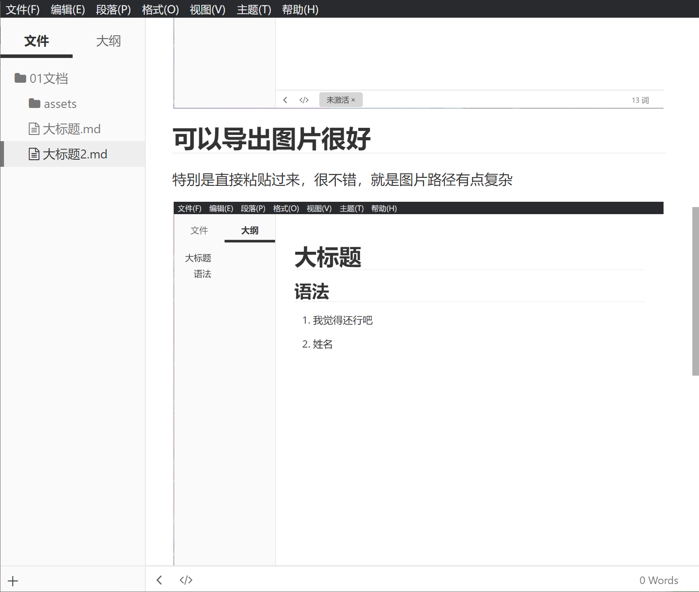

<!--
 * @Description: da
 * @Author: Liang xiaoqi
 * @Date: 2022-12-21 23:10:10
 * @LastEditTime: 2022-12-22 21:43:04
 * @LastEditors: Liang xiaoqi
-->
#
## day1
    msp432新建点灯工程，使用RTX系统
## day2-4
    尝试从底层出发去看编译的过程，移植ti的驱动代码并新建keil工程
## day5
```c
day5-1.RTX上OLED测试成功
day5-2.新增按键
day5-3.外部中断计时编码器
```

## day6

```c
1.学习使用markdown插入图片
```

	
